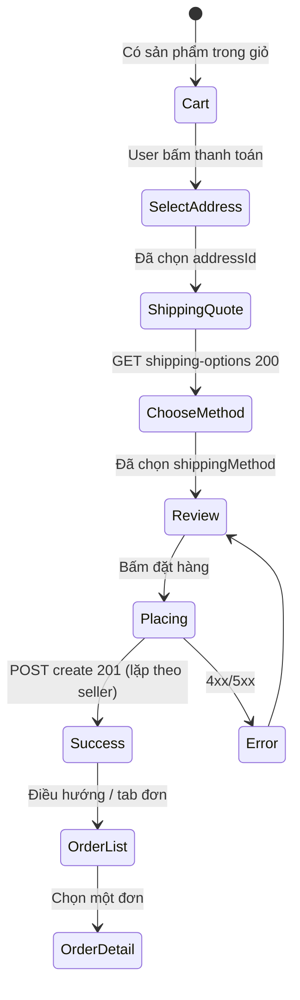

# Đặc tả cho AI / trợ lý code Frontend (đơn hàng + vận chuyển)

Tài liệu này **không thay** `doc.md` (contract API chi tiết). Mục đích: khi AI làm việc trên repo **frontend**, đọc file này trước để **hiểu luồng**, **biết tạo/sửa file nào**, và **tự hoàn thiện giao diện** nếu thiếu.

---

## 0. Cách dùng (bắt buộc đọc trước khi sửa code)

1. **Đọc `doc.md`** (cùng thư mục backend hoặc copy vào FE) để lấy path, query, body, response chính xác.
2. **Xác định stack FE** từ `package.json` của project frontend (React/Vue/Svelte/Next…). Không đoán stack nếu đã có lockfile và dependencies.
3. **Nếu màn hình / file API / type chưa tồn tại**: tự **tạo file mới** theo cấu trúc mục 4; không chờ người dùng chỉ định từng file.
4. **Luôn** xử lý: loading, lỗi API (`message` từ JSON), empty state, và vô hiệu hóa nút khi thiếu dữ liệu bắt buộc.
5. **Không** tin `shippingFee` / `totalPrice` do user sửa trên UI; hiển thị preview có thể lấy từ `shipping-options`, nhưng sau `create` phải dùng số **server trả về**.

---

## 1. Biến môi trường & HTTP

| Biến | Ý nghĩa |
|------|--------|
| `VITE_API_BASE_URL` / `NEXT_PUBLIC_API_BASE_URL` / tương đương | Origin API, ví dụ `http://localhost:3000` |
| Prefix API | **`/api/v1`** |

**URL đầy đủ ví dụ:** `{API_BASE}/api/v1/order/...`

**Header auth (mặc định):**

```http
Authorization: Bearer <access_token>
Content-Type: application/json
```

Nếu project đang dùng header `token` (legacy backend), giữ thống nhất với phần còn lại của app FE.

---

## 2. Luồng nghiệp vụ — trạng thái UI (state machine)

AI phải map từng bước sang **màn hình hoặc step** trong checkout.



**Quy tắc nghiệp vụ quan trọng:**

| Điều kiện | Hành vi UI |
|-----------|------------|
| Giỏ có sản phẩm từ **nhiều `sellerId`** | Gom `items` theo seller → **mỗi seller một lần** `POST /order/create` (tuần tự hoặc song song; nên hiển thị tiến trình từng đơn). |
| `GET shipping-options` với `productIds` trả `multiSeller: true` | **Không** render radio/checkbox `express` từ `combinedOptions` (server đã loại). Hiển thị `expressUnavailableReason` nếu có. |
| Một seller | Cho phép `express` nếu API trả trong `options` / `combinedOptions`. |
| Chưa chọn địa chỉ | Không gọi `shipping-options`; nút tiếp tục disabled. |
| `shipping-options` lỗi 400/404 | Hiển thị `message`; không cho chọn ship method. |

---

## 3. Ma trận màn hình / component (Definition of Done)

AI cần đảm bảo các phần sau **hoặc tương đương** đã có trong project FE. Nếu thiếu → **tạo mới**.

| ID | Mục đích | Hành động API | Trạng thái UI tối thiểu |
|----|----------|---------------|-------------------------|
| **S1** | Danh sách đơn (người mua) | `GET /api/v1/order/` | Loading skeleton; empty “Chưa có đơn”; list có `orderCode`, `totalPrice`, `status`, ngày; click → detail |
| **S2** | Chi tiết đơn | `GET /api/v1/order/:id` | 404 → thông báo; hiển thị items (populate), seller, ship method, fee, địa chỉ, status |
| **S3** | Checkout — chọn địa chỉ | API địa chỉ (ngoài `doc.md` order) | User chọn 1 địa chỉ → lưu `addressId` + snapshot cho `shippingAddress` |
| **S4** | Checkout — phí vận chuyển | `GET /api/v1/order/shipping-options?productIds=...&addressId=...` | Hiển thị `combinedOptions` hoặc legacy `options`; disabled express khi không có trong response |
| **S5** | Checkout — đặt hàng | `POST /api/v1/order/create` | Body đúng schema `doc.md`; sau 201 hiển thị `orderCode` / link tới S2; lỗi hiển thị `message` |

**Snapshot `shippingAddress` (bắt buộc khớp field backend):**  
`fullName`, `phoneNumber`, `address`, `city`, `district`, `ward` — map từ địa chỉ user chọn (tên field ở API địa chỉ có thể khác → **map rõ trong một hàm** `toShippingAddress()`).

---

## 4. Gợi ý cấu trúc file (tạo nếu chưa có)

Điều chỉnh tên thư mục cho khớp convention của project (src/app, pages, v.v.).

```
src/
  api/
    order.ts              # fetch shipping-options, create, list, getById
    client.ts             # base URL + auth header từ storage/context
  types/
    order.api.ts          # type từ response (hoặc dùng zod schema)
  features/checkout/
    CheckoutPage.tsx      # hoặc .vue — orchestration S3–S5
    ShippingMethodStep.tsx
    groupCartBySeller.ts  # pure function: CartLine[] -> Map<sellerId, lines>
  features/orders/
    OrderListPage.tsx
    OrderDetailPage.tsx
```

**Quy tắc cho AI:** Nếu repo chỉ có `src/App.tsx` và chưa có `api/order.ts`, **tạo** `api/order.ts` + tách type; không nhồi toàn bộ fetch vào một component > 200 dòng nếu có thể tách.

---

## 5. Types gợi ý (TypeScript) — đồng bộ với backend

Dùng làm mục tiêu cho AI generate; sửa field nếu `doc.md` thay đổi.

```typescript
// Phương thức vận chuyển — khớp backend
export type ShippingMethod = "economy" | "fast" | "express";

export type ShippingOptionRow = {
  method: ShippingMethod | string;
  label: string;
  fee: number;
  estimatedDays: string;
  distanceKm?: number;
  note?: string;
};

/** Response khi gọi productIds (giỏ / nhiều SP) */
export type ShippingOptionsMultiResponse = {
  multiSeller: boolean;
  expressAvailable: boolean;
  expressUnavailableReason?: string;
  sellers: Array<{
    sellerId: string;
    productIds: string[];
    sellerProvince: string;
    buyerProvince: string;
    isSameProvince: boolean;
    options: ShippingOptionRow[];
  }>;
  combined: { economy: number; fast: number; express: number | null };
  combinedOptions: ShippingOptionRow[];
};

/** POST /order/create body — xem doc.md */
export type CreateOrderBody = {
  sellerId: string;
  items: Array<{
    productId: string;
    variant: { color: string; size: string };
    quantity: number;
    price: number;
  }>;
  shippingMethod: ShippingMethod;
  shippingAddress: {
    fullName: string;
    phoneNumber: string;
    address: string;
    city: string;
    district: string;
    ward: string;
  };
  notes?: string;
};
```

---

## 6. Pseudo-algorithm: đặt hàng nhiều seller (AI implement đúng behavior)

```
lines = cartLinesWithProductIdSellerIdPriceVariant()
bySeller = groupBy(lines, line => line.sellerId)
selectedMethod = UI.selectedShippingMethod  // economy | fast | express

for each (sellerId, lines) of bySeller:
  if selectedMethod === "express" && bySeller.size > 1:
    // Không được xảy ra nếu UI đã ẩn express khi multiSeller
    throw hoặc fallback sang fast/economy + thông báo

  body = {
    sellerId,
    items: lines.map(toCreateItem),
    shippingMethod: selectedMethod,
    shippingAddress: snapshotFromSelectedAddress(),
    notes: optional
  }
  POST /api/v1/order/create
  nếu một request fail: hiển thị lỗi, có thể dừng hoặc cho phép retry từng đơn (UX tùy chọn, ghi rõ trong UI)
```

---

## 7. Checklist tự kiểm (AI đánh dấu khi xong)

- [ ] Token được gắn vào mọi request order (trừ khi route public — order không public).
- [ ] `shipping-options` dùng đúng query: `productIds` CSV hoặc `productId` đơn (legacy).
- [ ] Multi-seller: không offer `express` khi API báo `expressAvailable === false`.
- [ ] `create` lặp theo seller; mỗi body chỉ chứa items của đúng seller đó.
- [ ] Danh sách đơn + chi tiết đơn hoạt động với response `{ orders }` / `{ order }`.
- [ ] Xử lý `401` → điều hướng login hoặc refresh token (theo pattern app).
- [ ] Không hard-code `localhost` trong component; dùng env.

---

## 8. Khi mâu thuẫn giữa các tài liệu

**Ưu tiên:** code backend trong repo `NodeTS` (`orderController.ts`, `orderRouter.ts`) > `doc.md` > file này. Nếu phát hiện lệch, cập nhật `doc.md` và type FE cùng lúc.

---

*Tệp này nằm trong repo backend để chia sẻ cho team FE / clone sang repo FE. Copy sang repo frontend hoặc symlink nếu cần AI chỉ đọc một repo.*
