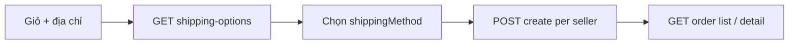

# API Đơn hàng & vận chuyển (cho Frontend)

Tài liệu mô tả luồng **đặt hàng**, **xem danh sách / chi tiết đơn**, và API **phương án vận chuyển** (`shipping-options`).

**Cho AI / trợ lý code FE:** đọc thêm [`FE_AI_SPEC.md`](./FE_AI_SPEC.md) — ma trận màn hình, state machine, cấu trúc file gợi ý, types và checklist để tự tạo/sửa UI.

**Base path đơn hàng:** `{BASE_URL}/api/v1/order`  
`BASE_URL` dev thường là `http://localhost:3000`.

**Xác thực (dùng chung):** header `Authorization: Bearer <access_token>` hoặc `token: <access_token>`. Role được phép các API dưới đây: `admin`, `user`, `seller` (trừ khi ghi chú khác).

---

## Luồng nghiệp vụ: từ giỏ hàng đến sau khi đặt

1. User chọn **địa chỉ nhận** (lấy từ API địa chỉ, có `_id` dùng làm `addressId`).
2. Gọi **`GET /order/shipping-options`** với `productIds` (hoặc `productId`) + `addressId` để hiển thị phí và chọn `shippingMethod` (`economy` | `fast` | `express`).
3. Chuẩn bị **`shippingAddress`** cho body tạo đơn: object đầy đủ họ tên, SĐT, địa chỉ, **city** (tỉnh/thành), **district**, **ward** — khớp dữ liệu user đã chọn (snapshot tại thời điểm đặt).
4. Gọi **`POST /order/create`** với **một `sellerId`** và **`items`** chỉ gồm sản phẩm của seller đó. Giỏ nhiều cửa hàng → **gọi `create` nhiều lần**, mỗi lần một seller (và `shippingMethod` / phí ship server tính **theo từng đơn một kho**).
5. **`GET /order/`** — danh sách đơn của **người mua** (theo `userId` trong token).
6. **`GET /order/:id`** — chi tiết một đơn (chỉ khi đơn thuộc user đang đăng nhập).



---

## Tạo đơn hàng

| | |
|---|---|
| **Method** | `POST` |
| **Path** | `/api/v1/order/create` |
| **Content-Type** | `application/json` |

### Body (JSON)

| Field | Bắt buộc | Kiểu | Mô tả |
|-------|----------|------|--------|
| `sellerId` | Có | string (ObjectId) | Seller của **toàn bộ** `items` trong request này. |
| `items` | Có | array | Không rỗng. Mỗi phần tử xem bảng dưới. |
| `shippingAddress` | Có | object | Địa chỉ giao — snapshot; schema bên dưới. |
| `shippingMethod` | Có | string | `"economy"` \| `"fast"` \| `"express"`. |
| `notes` | Không | string | Ghi chú đơn hàng. |

**Phần tử `items[]`:**

| Field | Bắt buộc | Mô tả |
|-------|----------|--------|
| `productId` | Có | ObjectId sản phẩm (thuộc đúng `sellerId`). |
| `variant.color` | Có | string |
| `variant.size` | Có | string |
| `quantity` | Có | number, &gt; 0 |
| `price` | Có | number, &gt; 0 — **đơn giá** tại thời điểm đặt (server không lấy lại giá từ DB trong đoạn hiện tại). |

**`shippingAddress` (bắt buộc đủ field để pass schema):**

| Field | Kiểu | Ghi chú |
|-------|------|--------|
| `fullName` | string | |
| `phoneNumber` | string | |
| `address` | string | Địa chỉ chi tiết (số nhà, đường, …). |
| `city` | string | Tỉnh / thành phố — dùng so khớp **hỏa tốc** với tỉnh kho seller (`express`). |
| `district` | string | Quận / huyện |
| `ward` | string | Phường / xã |

### Phí ship khi tạo đơn (server tự tính)

- **`economy`:** cố định **20.000** VND / đơn.  
- **`fast`:** cố định **35.000** VND / đơn.  
- **`express`:** theo km ước lượng (kho seller ↔ địa chỉ giao), **4.000đ/km**; chỉ khi **cùng tỉnh** (`shippingAddress.city` so với kho seller). Nếu seller chưa có kho hoặc khác tỉnh → `400`.

**Không** gửi `shippingFee` / `totalPrice` từ client để quyết định thanh toán — backend tính `shippingFee` và `totalPrice = tổng (price × quantity) + shippingFee`.

### Response thành công

- **`201 Created`** — body là object đơn hàng đã lưu (Mongoose), gồm `_id`, `orderCode`, `userId`, `sellerId`, `items`, `shippingMethod`, `shippingFee`, `totalPrice`, `shippingAddress`, `status` (`pending`), `createdAt`, …

### Lỗi thường gặp (tạo đơn)

| HTTP | Nguyên nhân gợi ý |
|------|-------------------|
| 400 | Thiếu field; `shippingMethod` sai; `items` rỗng / sai cấu trúc; `express` không đủ điều kiện tỉnh / thiếu kho |
| 401 | Chưa đăng nhập |
| 500 | Lỗi server |

### Ví dụ `fetch`

```javascript
const body = {
  sellerId: "507f1f77bcf86cd799439011",
  items: [
    {
      productId: "64a1b2c3d4e5f6789012345",
      variant: { color: "Đen", size: "M" },
      quantity: 2,
      price: 199000,
    },
  ],
  shippingMethod: "economy",
  shippingAddress: {
    fullName: "Nguyễn Văn A",
    phoneNumber: "0901234567",
    address: "123 Đường ABC",
    city: "Hà Nội",
    district: "Cầu Giấy",
    ward: "Dịch Vọng Hậu",
  },
  notes: "Giao buổi sáng",
};

const res = await fetch(`${BASE_URL}/api/v1/order/create`, {
  method: "POST",
  headers: {
    "Content-Type": "application/json",
    Authorization: `Bearer ${accessToken}`,
  },
  body: JSON.stringify(body),
});
const order = await res.json();
// order._id, order.orderCode, order.totalPrice, ...
```

---

## Lấy danh sách đơn hàng

| | |
|---|---|
| **Method** | `GET` |
| **Path** | `/api/v1/order/` |

- Chỉ trả các đơn có **`userId` trùng user đang đăng nhập** (góc nhìn **người mua**).
- Sắp xếp **`createdAt` giảm dần** (mới nhất trước).
- Populate: **`sellerId`** (fields `name`, `email`), **`items.productId`** (thông tin sản phẩm).

### Response `200`

```json
{
  "message": "Lấy danh sách đơn hàng thành công",
  "orders": [ /* mảng Order đã populate */ ]
}
```

### Ví dụ

```javascript
const res = await fetch(`${BASE_URL}/api/v1/order/`, {
  headers: { Authorization: `Bearer ${accessToken}` },
});
const { orders } = await res.json();
```

---

## Xem chi tiết một đơn hàng

| | |
|---|---|
| **Method** | `GET` |
| **Path** | `/api/v1/order/:id` |
| **`:id`** | `_id` MongoDB của đơn hàng |

- Chỉ trả đơn nếu **`userId` đơn = user trong token**; không thấy → `404`.

### Response `200`

```json
{
  "message": "Lấy đơn hàng thành công",
  "order": { /* một Order, populate sellerId + items.productId */ }
}
```

### Ví dụ

```javascript
const orderId = "673abc...";
const res = await fetch(`${BASE_URL}/api/v1/order/${orderId}`, {
  headers: { Authorization: `Bearer ${accessToken}` },
});
const { order } = await res.json();
```

---

## Trạng thái đơn (`status`)

Giá trị trong model: `pending` → `shipping` → `delivered`, hoặc `cancelled`.  
Cập nhật trạng thái qua **`PUT /api/v1/order/status/:id`** (thường seller/admin) — không mở rộng chi tiết tại đây.

---

## Phương án vận chuyển (`shipping-options`)

Dùng khi chọn địa chỉ nhận và hiển thị phí ship (một hoặc nhiều sản phẩm / nhiều cửa hàng).

| | |
|---|---|
| **Method** | `GET` |
| **Path** | `/api/v1/order/shipping-options` |
| **Ví dụ** | `GET {BASE_URL}/api/v1/order/shipping-options?productIds=...&addressId=...` |

---

## Query parameters (`shipping-options`)

| Tham số | Bắt buộc | Mô tả |
|---------|----------|--------|
| `addressId` | Có | `_id` của **địa chỉ giao hàng** trong danh sách địa chỉ của **user đang đăng nhập** (MongoDB ObjectId). |
| `productId` | Một trong hai nhóm | **Chế độ legacy (1 SP):** một id sản phẩm. |
| `productIds` | Một trong hai nhóm | **Chế độ giỏ / nhiều SP:** danh sách id, cách nhau bằng dấu phẩy `,` (khoảng trắng có thể có). Trùng id sẽ được loại bỏ. |

**Quy ước:**

- Dùng **`productId` + `addressId`** khi màn hình chỉ có **một** sản phẩm → response dạng **cũ** (flat, dễ tích hợp code cũ).
- Dùng **`productIds` + `addressId`** khi có **giỏ hàng** (1 hoặc nhiều sản phẩm) → response dạng **mới** (`sellers`, `combined`, `combinedOptions`).

Không gửi cả `productId` lẫn `productIds` cùng lúc cũng được; nếu có **`productIds`** thì backend ưu tiên xử lý theo `productIds` (chuỗi sau `split(",")`), không đọc `productId` trong nhánh đó. Thực tế FE nên chỉ gửi một kiểu cho rõ ràng.

---

## Hành vi nghiệp vụ (tóm tắt)

1. Backend lấy **kho** của từng seller (`type === "warehouse"` trong địa chỉ của seller) và so với **địa chỉ nhận** của buyer (`addressId`).
2. **Tiết kiệm (`economy`)** và **nhanh (`fast`)**: mỗi **cửa hàng (mỗi kho)** một mức phí cố định → khi nhiều cửa hàng, phí **cộng dồn** (`combined.economy`, `combined.fast`).
3. **Hỏa tốc (`express`)**: chỉ khi **tất cả sản phẩm cùng một seller** và **kho cùng tỉnh/thành** với địa chỉ nhận (ước lượng km theo quận/phường).  
   Nếu **từ 2 seller trở lên** → **không** có hỏa tốc; `expressAvailable: false` và có thêm `expressUnavailableReason`.

---

## Response — chế độ legacy (`productId` + `addressId`, đúng 1 sản phẩm)

`200 OK`

```json
{
  "sellerId": "507f1f77bcf86cd799439011",
  "sellerProvince": "Hà Nội",
  "buyerProvince": "Hà Nội",
  "isSameProvince": true,
  "options": [
    {
      "method": "economy",
      "label": "Vận chuyển tiết kiệm",
      "fee": 20000,
      "estimatedDays": "3-5 ngày"
    },
    {
      "method": "fast",
      "label": "Vận chuyển nhanh",
      "fee": 35000,
      "estimatedDays": "1-2 ngày"
    },
    {
      "method": "express",
      "label": "Vận chuyển hỏa tốc",
      "fee": 8000,
      "estimatedDays": "Trong ngày",
      "distanceKm": 2,
      "note": "Ước tính 2km × 4,000đ"
    }
  ]
}
```

- `options` có thể **không** có object `express` nếu khác tỉnh với kho.
- `fee` tính bằng **VND** (số nguyên).

---

## Response — chế độ `productIds` (giỏ / nhiều SP)

`200 OK`

```json
{
  "multiSeller": true,
  "expressAvailable": false,
  "expressUnavailableReason": "Đơn có nhiều cửa hàng: không áp dụng hỏa tốc; phí tiết kiệm / nhanh là tổng từng kho đến bạn.",
  "sellers": [
    {
      "sellerId": "507f1f77bcf86cd799439011",
      "productIds": ["64a1...", "64a2..."],
      "sellerProvince": "Hà Nội",
      "buyerProvince": "Hà Nội",
      "isSameProvince": true,
      "options": [
        { "method": "economy", "label": "Vận chuyển tiết kiệm", "fee": 20000, "estimatedDays": "3-5 ngày" },
        { "method": "fast", "label": "Vận chuyển nhanh", "fee": 35000, "estimatedDays": "1-2 ngày" }
      ]
    },
    {
      "sellerId": "507f191e810c19729de860ea",
      "productIds": ["64b3..."],
      "sellerProvince": "TP.HCM",
      "buyerProvince": "Hà Nội",
      "isSameProvince": false,
      "options": [
        { "method": "economy", "label": "Vận chuyển tiết kiệm", "fee": 20000, "estimatedDays": "5-7 ngày" },
        { "method": "fast", "label": "Vận chuyển nhanh", "fee": 35000, "estimatedDays": "2-3 ngày" }
      ]
    }
  ],
  "combined": {
    "economy": 40000,
    "fast": 70000,
    "express": null
  },
  "combinedOptions": [
    {
      "method": "economy",
      "label": "Vận chuyển tiết kiệm (tổng các kiện)",
      "fee": 40000,
      "estimatedDays": "5-10 ngày (theo từng cửa hàng)"
    },
    {
      "method": "fast",
      "label": "Vận chuyển nhanh (tổng các kiện)",
      "fee": 70000,
      "estimatedDays": "3-5 ngày (theo từng cửa hàng)"
    }
  ]
}
```

- **`multiSeller`**: `true` nếu có từ 2 seller trở lên.
- **`expressUnavailableReason`**: chỉ có khi `multiSeller === true`.
- **`sellers`**: chi tiết theo từng seller; `options` của từng seller **không** có `express` nếu `multiSeller` (nhiều cửa hàng).
- **`combined`**: tổng phí — dùng để hiển thị tổng hoặc so sánh nhanh.
- **`combinedOptions`**: danh sách chọn trên UI (economy / fast / express nếu được). Khi một seller, có thể có thêm phương án `express` trong `combinedOptions` nếu đủ điều kiện.

Khi **chỉ một seller** nhưng vẫn gọi bằng `productIds`: `multiSeller: false`, `expressAvailable` phụ thuộc cùng tỉnh với kho; `combined.express` là số phí hoặc `null`.

---

## Kiểu object `option` (dùng chung)

| Field | Kiểu | Ghi chú |
|-------|------|---------|
| `method` | string | `"economy"` \| `"fast"` \| `"express"` |
| `label` | string | Nhãn hiển thị |
| `fee` | number | VND |
| `estimatedDays` | string | Text ước lượng thời gian |
| `distanceKm` | number? | Chỉ với `express` (legacy hoặc combined express) |
| `note` | string? | Ghi chú thêm (ví dụ công thức km) |

---

## Lỗi thường gặp (`shipping-options`)

| HTTP | `message` (ví dụ) |
|------|-------------------|
| 400 | Thiếu `productId`/`productIds` hoặc `addressId`; id không hợp lệ; có SP không active; seller chưa cấu hình kho |
| 401 | Chưa xác thực / token không hợp lệ |
| 404 | Không tìm thấy địa chỉ giao của user; một hoặc nhiều `productId` không tồn tại |
| 500 | Lỗi server |

---

## Ví dụ gọi API — `shipping-options` (JavaScript)

### 1 sản phẩm (response legacy)

```javascript
const params = new URLSearchParams({
  productId: "64a1b2c3d4e5f6789012345",
  addressId: "64fedcba9876543210fedc",
});

const res = await fetch(
  `${BASE_URL}/api/v1/order/shipping-options?${params}`,
  {
    headers: {
      Authorization: `Bearer ${accessToken}`,
      "Content-Type": "application/json",
    },
  }
);
const data = await res.json();
```

### Giỏ nhiều sản phẩm (response `combined` + `sellers`)

```javascript
const ids = ["64a1...", "64a2...", "64b3..."];
const params = new URLSearchParams({
  productIds: ids.join(","),
  addressId: "64fedcba9876543210fedc",
});

const res = await fetch(
  `${BASE_URL}/api/v1/order/shipping-options?${params}`,
  {
    headers: { Authorization: `Bearer ${accessToken}` },
  }
);
const data = await res.json();

// Hiển thị tổng phí theo phương thức user chọn:
const economyFee = data.combined?.economy;
const fastFee = data.combined?.fast;
const expressFee = data.combined?.express; // null nếu không áp dụng

// Hoặc render radio từ combinedOptions:
data.combinedOptions?.forEach((opt) => {
  console.log(opt.method, opt.fee, opt.label);
});
```

---

## Khớp phí giữa `shipping-options` và `create`

- **`shipping-options`** với **nhiều seller** trả **`combined`** = tổng phí **mỗi kho một lần** (economy/fast cộng dồn).
- **`create`** hiện tính **một mức economy/fast cho cả đơn** (20k / 35k), **không** nhân theo số seller trong một request — vì **mỗi request chỉ một seller**.  
→ Với **một seller / một đơn**, số hiển thị từ `shipping-options` (một kho) khớp với `create`.  
→ Giỏ **nhiều seller**: tổng ship thực tế = **tổng** phí của **từng lần** `create` (mỗi đơn một kho).

---

*Tài liệu phản ánh `orderController` + `orderRouter` (create, list, detail, shipping-options). Cập nhật file này khi đổi contract API.*
